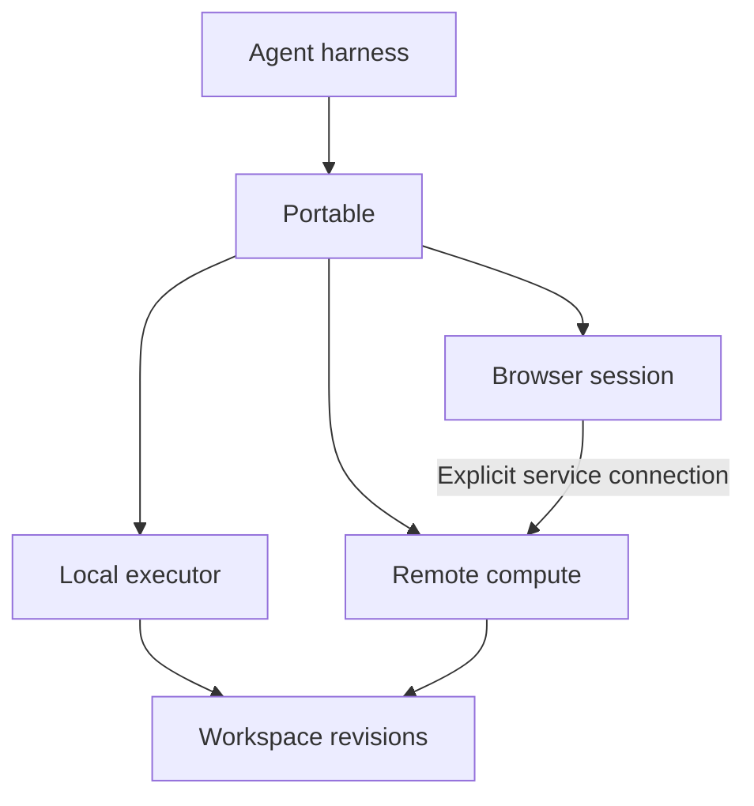

# Portable

Portable lets agents attach compute, browsers, and other execution capabilities while preserving explicit work state.

Keep your agent. Attach the execution capabilities it needs. Release compute when the work finishes.

**Status:** Implementation in progress. The TypeScript toolchain, library entry, and CLI bootstrap exist. Runtime features, stores, and adapters arrive by milestone.

Read the [full specification](SPEC.md) for the proposed contracts, failure behavior, interfaces, and release criteria.

## The idea

An agent can need several environments during one task: local files, remote builds, and a browser with persistent login state.

Portable proposes a common contract for attaching those environments and handing work between them. Each environment advertises its capabilities. The agent requests the capabilities it needs within the user's authorized limits.

The harness runs the agent loop and manages its conversation, tools, and approvals. Portable manages execution attachments, workspace revisions, and resource lifetimes.

Claude Code, Codex, OpenCode, and custom harnesses are intended integration targets.

## What Portable enables

| Use case | Example |
| --- | --- |
| Scale | Attach a machine with more memory for a build. |
| Specialize | Attach a browser, graphics processor, or mobile simulator. |
| Move | Run work against the same workspace revision on another provider or architecture. |
| Compose | Use independent providers for compute, browser sessions, and workspace storage. |

## First demonstration

The first demonstration uses one harness, lightweight Python, local execution, remote execution, and an independently attached browser.

1. The agent inspects repository data through lightweight Python.
2. Portable attaches local execution when the task requires native processes.
3. Portable checkpoints the workspace and attaches an independent browser.
4. Portable replaces local compute with remote compute and reconstructs the application server.
5. The existing browser inspects the application through a new service connection.
6. Portable demonstrates recovery from an injected replacement failure and returns results with their input revisions.
7. Portable releases compute and reports which workspace state and resources remain available.

The browser session can remain attached after compute is released. The application connection ends when its server stops.

Local edits made during verification create newer work. Test results for an earlier revision do not verify those edits.

## Core contracts

### Capabilities

A capability describes versioned behavior, such as process execution, workspace access, or browser interaction. An environment can provide several capabilities.

Requirements are mandatory. Preferences, such as locality, can be relaxed only within the authorized policy.

Adapters must define operation behavior, including cancellation, retries, output limits, and side effects. Conformance tests check those claims.

### Workspaces

A workspace contains portable files and explicit durable state. Each checkpoint produces an immutable revision.

The first implementation should use one authoritative writer. Remote environments receive a revision and return proposed changes. Applying those changes requires checking the base revision and handling conflicts explicitly.

Execution results record the revision they use. Recreated dependencies and generated artifacts need enough provenance to interpret those results.

### Resources

Processes, browser sessions, and other resources have explicit references and lifetimes. A resource identifier grants no authority by itself.

Each attachment has a generation number. Replacing an attachment invalidates its old handles without invalidating unrelated attachments.

### Handoffs

A handoff reports which state is preserved, reconstructed, reattached, or invalidated.

Before authority switches, the source remains authoritative. The implementation must record the switch durably and prevent stale writers from modifying authoritative state.

Recovery must handle failures before and after the switch. An operation with an uncertain outcome remains unknown until reconciled. Portable must not retry an unsafe operation automatically.

### Authorization

The harness supplies authorized limits. Portable checks requests against those limits and requires an environment that enforces them.

A request for network access is not approval. An advertised restriction is not evidence that the provider enforces it.

## Integration approach

Start with a TypeScript library and a thin command-line interface. Expose operations to describe, attach, invoke, checkpoint, replace, and release resources.

A Model Context Protocol (MCP) server is deferred. The first release proves composition and replacement through the library contracts.

These tools provide an explicit route to Portable execution. They do not automatically redirect a harness's built-in shell or file tools.

Each integration must define which workspace is authoritative and how local edits reach remote environments. Deeper harness integration can follow.

## Scope

The first release targets execution composition and explicit work handoff. It does not implement a new agent loop, sandbox, scheduler, or universal conversation format.

Remote execution does not keep a laptop-hosted harness running when the laptop shuts down. Continuous agent operation requires a persistent harness host or a separate resume mechanism.

Model replacement, harness migration, and transparent process migration are outside the first release.

## Evidence before expansion

The first implementation should demonstrate:

- A remote run against an identified workspace revision.
- Conflict detection when local files change during remote work.
- A browser session that survives compute replacement.
- Rejection of handles from a replaced attachment.
- Recovery from injected handoff failures without competing authoritative writers.
- Explicit unknown outcomes when an operation's response is lost.
- Rejection of environments that cannot satisfy authorized limits.

The first release includes lightweight Python, local processes, remote Linux, and an independent browser. Add more architectures and generated adapters after these contracts hold across the initial adapters.

The broader thesis: **An agent can outlive its computers.**

See [the original idea document](IDEAEA.md) for the broader design exploration.

## Development

The implementation is a TypeScript library with a thin CLI. Node.js 22 or newer is required.

1. Install dependencies: `npm install`
2. Build and type-check: `npm run build`
3. Run the test suite: `npm test`
4. Run the CLI: `node dist/cli/main.js --help`

Module boundaries follow the architecture in the specification:

- `src/index.ts` is the library entry point. The CLI and harness integrations call it.
- `src/cli` is the CLI. It calls library contracts and implements no lifecycle rules of its own.
- `src/runtime` will hold request validation, routing, lifecycle, journaling, and replacement recovery. It never imports an adapter directly.
- `src/store` will hold the durable control store and the content-addressed workspace store.
- `src/adapters` will hold independent adapter modules loaded behind library interfaces.

Work items live in `to-do.json` with references to the specification sections they implement.
