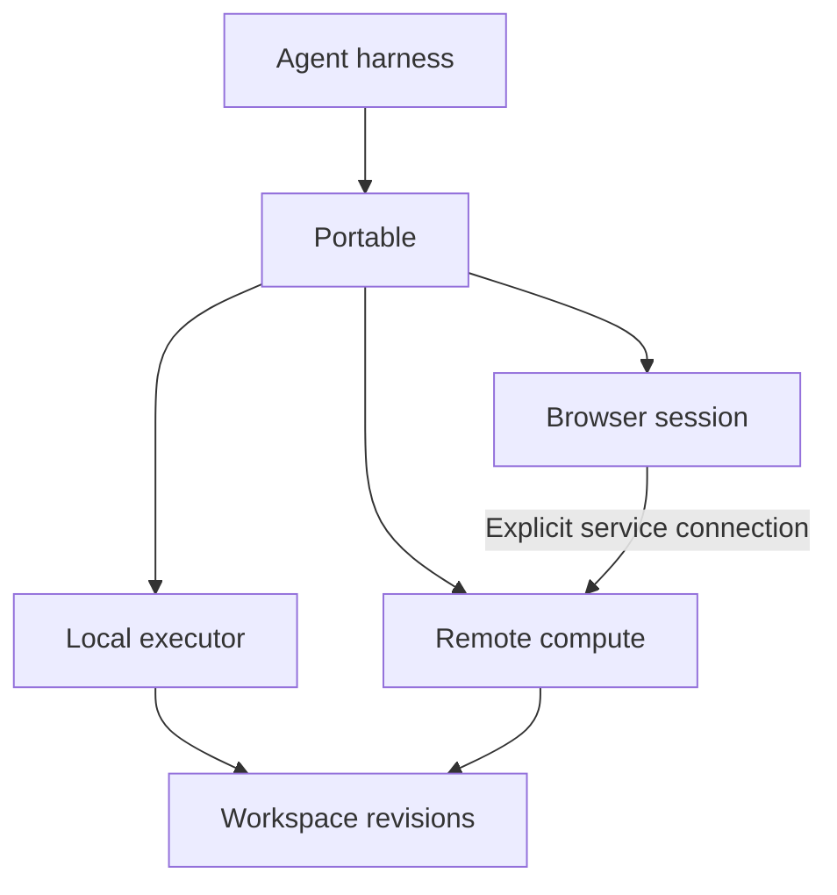

# Portable

Portable lets agents attach compute, browsers, and other execution capabilities while preserving explicit work state.

Keep your agent. Attach the execution capabilities it needs. Release compute when the work finishes.

**Status:** First release complete. The library, CLI, adapters, conformance suite, and acceptance demonstration are implemented against [the specification](SPEC.md) version `0.1.0-draft.1`. Every normative statement is mapped to code and evidence in [the release coverage review](docs/release-coverage.md).

## The idea

An agent can need several environments during one task: local files, remote builds, and a browser with persistent login state.

Portable is a common contract for attaching those environments and handing work between them. Each environment advertises its capabilities. The agent requests the capabilities it needs within the user's authorized limits.

The harness runs the agent loop and manages its conversation, tools, and approvals. Portable manages execution attachments, workspace revisions, and resource lifetimes.



## What Portable enables

| Use case | Example |
| --- | --- |
| Scale | Attach a machine with more memory for a build. |
| Specialize | Attach a browser, graphics processor, or mobile simulator. |
| Move | Run work against the same workspace revision on another provider or architecture. |
| Compose | Use independent providers for compute, browser sessions, and workspace storage. |

## Use the library

One session, one attachment, one checkpoint, one release:

```ts
import {
  BlobStore,
  ControlStore,
  LocalProcessAdapter,
  PolicyAuthority,
  PortableRuntime,
} from "portable";

const store = ControlStore.open("control.db");
const blobs = new BlobStore("blobs", store);
const session = await new PortableRuntime(store).createSession({
  policyRef: "policy://demo",
});

const authority = PolicyAuthority.fromPolicy({
  schemaVersion: 1,
  providers: ["local-process"],
  operations: ["exec.process@1"],
});
const adapter = new LocalProcessAdapter({ supervisorDir: "./supervisor" });

// Attach one environment. The request key makes the acquisition durable.
const compute = await session.attach({
  adapter,
  request: { name: "build", providerId: "local-process", requires: {} },
  requestKey: "attach-build-1",
  principal: "user://me",
  authority,
});
const ref = {
  sessionId: session.id,
  attachmentId: compute.attachmentId,
  generation: compute.generation,
};

// Admit, dispatch, settle: the record exists before the provider runs,
// and the outcome lands before the caller hears it.
const admitted = await session.invoke(
  {
    attachment: ref,
    capability: "exec.process@1",
    operation: "run",
    input: { command: "node", args: ["--version"] },
    requestKey: "version-1",
  },
  { authority },
);
await session.markDispatched(admitted.id);
const lease = adapter.lease(compute.environmentId!);
const answered = await lease.invoke({
  operationId: admitted.id,
  capability: "exec.process@1",
  operation: "run",
  input: { command: "node", args: ["--version"] },
  environmentId: lease.environmentId,
  limits: {},
});
await session.settle(admitted.id, {
  kind: "completed",
  resultRef: JSON.stringify(answered.result ?? null),
});

// Checkpoint the workspace as one immutable revision.
const checkpoint = await session.checkpoint(
  blobs,
  { requestKey: "snapshot-1", source: { kind: "bridge", rootPath: "./repo" } },
  { stability: { kind: "locked", detail: "No bridge writer is active." } },
);

// Release the environment. A later process reopens the session with
// the revision retained and no conversation restored.
await session.release(ref, "release-build-1", { adapter, principal: "user://me" });
store.close();
const again = await new PortableRuntime(ControlStore.open("control.db")).openSession(
  session.id,
);
const report = await again.reopen(); // report.conversationRestored === false
```

The CLI calls the same contracts. See [the CLI reference](docs/cli.md):

```bash
node dist/cli/main.js attach --session ses_x --request attach-request.json
node dist/cli/main.js conformance --adapter ./worker-adapter.mjs \
  --adapter-version 1.2.3 --external-effects
```

For the OpenAI Agents SDK, [`AgentsToolkit`](docs/harness.md) exposes the same flow as three tools: `portable_environment`, `portable_checkpoint`, and `portable_run`.

## Core contracts

### Capabilities

A capability describes versioned behavior, such as process execution, workspace access, or browser interaction. An environment can provide several capabilities.

Requirements are mandatory. Preferences, such as locality, can be relaxed only within the authorized policy.

Adapters define operation behavior, including cancellation, retries, output limits, and side effects. The conformance suite checks those claims.

### Workspaces

A workspace contains portable files and explicit durable state. Each checkpoint produces an immutable revision.

Version one uses one authoritative writer. Remote environments receive a revision and return proposed changes. Applying a change checks the base revision and reports conflicts explicitly; nothing merges automatically.

Execution results record the revision they used and whether the working copy changed.

### Resources

Processes, browser sessions, and other resources have explicit references and lifetimes. A resource identifier grants no authority by itself.

Each attachment has a generation number. Replacing an attachment invalidates its old handles without touching unrelated attachments.

### Handoffs

A handoff reports which state is preserved, reconstructed, reattached, or invalidated.

Before authority switches, the source stays authoritative. The switch commits durably behind a fencing token, so a stale writer cannot commit after it.

Recovery handles failures before and after the switch. An operation with an uncertain outcome stays unknown until reconciled; Portable never retries an unsafe operation automatically.

### Authorization

The harness supplies the authenticated principal and the approved policy. Portable checks requests against those limits and requires an environment that enforces them.

A request for network access is not approval. An advertised restriction is not evidence that the provider enforces it.

## Known provider limitations

These limits are honest and documented, with details in the
[coverage review](docs/release-coverage.md#unsupported-requirements):

- The automated acceptance demonstration uses a local stand-in, not a
  remote Linux machine. The E2B adapter implements the remote Linux
  profile but needs operator credentials, and none exist in a test
  run. The stand-in identifies itself in every durable record.
- The reference browser driver loads documents over HTTP and executes
  no page script. It is not a rendered browser engine; a real
  integration supplies its own driver.
- `browser.cdp@1` is optional in the specification and no adapter
  offers it.
- Native snapshot restoration is optional and not implemented;
  replacement reconstructs state through recipes.

## Verify the release

The three release checks, with exact commands and expected outcomes,
live in [the coverage review](docs/release-coverage.md#verified-workflows):

1. Clean-checkout build: install from a fresh copy, run `npm test`.
2. Local conformance suite: run the section 21 case packs against the
   shipped adapters.
3. Acceptance demonstration: the seven-step walk of section 22.1,
   including the injected failure, the recovery, and the workspace
   conflict.

## Scope

The first release targets execution composition and explicit work handoff. It does not implement a new agent loop, sandbox, scheduler, or universal conversation format.

Remote execution does not keep a laptop-hosted harness running when the laptop shuts down. Continuous agent operation requires a persistent harness host or a separate resume mechanism.

Model replacement, harness migration, and transparent process migration are outside the first release. An MCP transport is deferred.

The broader thesis: **An agent can outlive its computers.**

See [the original idea document](IDEAEA.md) for the broader design exploration.

## Development

The implementation is a TypeScript library with a thin CLI. Node.js 22 or newer is required.

1. Install dependencies: `npm install`
2. Build and type-check: `npm run build`
3. Run the test suite: `npm test`
4. Run the CLI: `node dist/cli/main.js --help`

Module boundaries follow the architecture in the specification:

- `src/index.ts` is the library entry point. The CLI and harness integrations call it.
- `src/runtime` holds request validation, lifecycle, journaling, replacement, and recovery. It never imports an adapter.
- `src/store` holds the durable control store and the content-addressed workspace store.
- `src/adapters` holds independent adapter modules loaded behind library interfaces.
- `src/conformance` holds the section 21 case packs and the report runner.
- `src/acceptance` holds the section 22.1 demonstration driver.
- `src/harness` holds the Agents SDK toolkit.

Work items live in `to-do.json` with references to the specification sections they implement.
