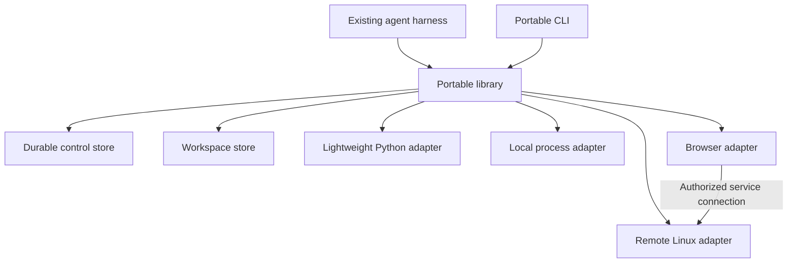

# Portable specification

Version: 0.1.0-draft.1  
Status: Proposed design; no implementation exists in this repository.  
Date: 2026-09-11

## 1. Purpose

Portable is a library for composing agent execution environments and handing work between them.

An existing harness owns the agent loop, model calls, conversation, and user approvals. Portable owns execution attachments, resource references, workspace revisions, and explicit replacement of environments.

The first release must demonstrate useful work across lightweight Python, local processes, remote Linux, and an independent browser. It must replace compute without losing the workspace or invalidating unrelated browser handles.

The implementation starts with a library and a thin command-line interface (CLI). A Model Context Protocol (MCP) server is optional future work.

### 1.1 Requirement language

In this document, MUST and MUST NOT define requirements. SHOULD defines a recommended default. MAY defines an optional feature.

All interfaces, identifiers, and commands below are proposed Portable contracts. They do not describe existing provider interfaces.

### 1.2 Product outcomes

| Outcome | Required demonstration |
| --- | --- |
| Scale | Attach native process execution after starting with lightweight Python. |
| Specialize | Attach a browser independently of compute. |
| Move | Replace local compute with remote compute using an explicit workspace revision. |
| Compose | Keep several attachments active under one logical session. |
| Recover | Resume a failed replacement without competing authoritative writers. |

### 1.3 Exclusions

Version one does not define model routing, a new agent loop, a universal transcript, or harness migration.

It does not implement a sandbox, distributed filesystem, cloud scheduler, billing abstraction, or secret vault. It uses providers for those functions.

It does not promise transparent process migration, automatic conflict merging, or exactly-once external effects.

Remote compute does not keep a laptop-hosted harness running after the laptop stops. That requires a persistent harness host or a separate resume mechanism.

## 2. Architecture and ownership



| Component | Owns |
| --- | --- |
| Harness | Planning, conversation, tool selection, and approval decisions. |
| Portable runtime | Request validation, attachment routing, lifecycle, journal, and replacement recovery. |
| Workspace store | Immutable file revisions, proposed changes, and authoritative head updates. |
| Control store | Session metadata, generations, leases, operations, transitions, and events. |
| Adapter | Translation between Portable contracts and provider behavior. |
| Provider | Actual execution, isolation, resource allocation, and supported enforcement. |

The runtime MUST check both requested capabilities and authorized limits. An adapter manifest alone does not establish trust in a provider.

Portable MUST NOT assume that attached environments share a filesystem, network, operating system, or identity system.

## 3. Terms and identifiers

| Term | Meaning |
| --- | --- |
| Session | Durable logical identity for a set of Portable attachments and work state. |
| Capability | A versioned semantic contract for operations. |
| Environment | A provider allocation that exposes capabilities. |
| Attachment | A named session binding to an environment. |
| Generation | A counter for the current binding of one attachment. |
| Lease | Time-bounded authority to use an environment or resource. |
| Resource | A process, browser session, service connection, or other stateful object. |
| Revision | An immutable workspace tree with content hashes. |
| Working copy | Mutable files materialized from a revision. |
| Proposal | A candidate revision and its base revision, pending acceptance. |
| Handoff | An explicit transition that declares what state survives. |
| Replacement | A handoff that changes the environment bound to one attachment. |

Identifiers MUST be opaque strings. Their representation MUST NOT grant authorization or embed credentials.

Examples use prefixes such as `ses_`, `att_`, `env_`, `res_`, `rev_`, `op_`, and `ho_`. Consumers MUST NOT infer behavior from prefixes.

Attachment names MUST be unique within a session. Names MUST match `[a-z][a-z0-9_-]{0,62}`.

Wire timestamps MUST use Coordinated Universal Time (UTC) with an explicit `Z` suffix. Durations MUST use integer milliseconds. Byte sizes MUST use integer bytes.

## 4. Core invariants

Implementations MUST maintain these invariants:

- One durable attachment record identifies its current environment and generation.
- A replacement changes only the target attachment's generation.
- A stale generation cannot invoke operations or accept workspace changes.
- Workspace revisions are immutable and validated by content hash.
- Accepting a proposal uses an atomic comparison against the expected workspace head.
- Every invocation records its attachment generation and workspace basis, when applicable.
- An uncertain external effect is reported as unknown, not safely failed.
- Resource references contain no reusable authorization secrets.
- Hard requirements and authorized limits cannot be relaxed by preferences.
- A committed switch is recovered forward; cleanup failure does not reverse authority.

These guarantees apply to Portable-managed operations. Direct provider access and edits outside a managed working copy are outside its enforcement boundary.

## 5. Sessions and control storage

### 5.1 Session record

```ts
interface SessionRecord {
  id: string;
  schemaVersion: 1;
  status: "open" | "closing" | "closed";
  workspaceId: string;
  eventSequence: number;
  policyRef: string;
  createdAt: string;
}

interface AttachmentRef {
  sessionId: string;
  attachmentId: string;
  generation: number;
}
```

Reopening a session restores metadata and reconciles leases. It does not restore the harness's conversation or continue its model loop.

### 5.2 Control store requirements

The control store MUST support durable transactions, uniqueness constraints, and atomic compare-and-swap updates.

The reference implementation SHOULD use a local transactional database. Multiple CLI processes MUST share the same store and locking rules.

Workspace blobs MAY live outside the control database. Their durable existence MUST be verified before a transaction references them.

An attachment mutation MUST acquire a durable mutation lease. Each acquisition receives a monotonically increasing fencing token. Every control mutation MUST validate that token in its transaction.

An expired worker MUST NOT commit after another worker acquires the lease. This requirement applies even if the expired worker later receives a successful provider response.

Provider acquisition MUST use a durable request identifier. An adapter MUST either support idempotent acquisition or reconcile allocations by that identifier.

If an allocation cannot be identified after an interrupted request, the runtime MUST report an unresolved allocation. It MUST NOT silently retry and forget potential resources.

### 5.3 Invocation admission

Invocation admission MUST atomically check session status, attachment status, generation, and lease validity while recording the operation.

Replacement preparation MUST block new admissions atomically before inspecting active operations. This prevents a new command from entering during quiescence.

Closing a session rejects new operations and schedules release of every attachment. The session remains `closing` until releases succeed or are explicitly recorded as unresolved.

## 6. Capability contracts

### 6.1 Identity and versioning

Capability identifiers use `name@major`, for example `exec.process@1` and `browser.session@1`.

Breaking semantic changes require a new major version. Additive optional fields MAY remain within the same major version.

Third-party names SHOULD use a domain namespace, such as `com.example.video.render@1`.

Provider-specific behavior MUST NOT be presented as a shared capability unless it satisfies that capability's semantics.

### 6.2 Descriptors

```ts
interface CapabilityDescriptor {
  id: string;
  operations: Record<string, OperationDescriptor>;
  attributes: Record<string, unknown>;
  extensions?: Record<string, unknown>;
}

interface OperationDescriptor {
  inputSchema: object;
  outputSchema: object;
  stateful: boolean;
  effects: "none" | "workspace" | "external" | "mixed";
  retry: "safe" | "deduplicated" | "unsafe";
  cancellation: "unsupported" | "best-effort" | "confirmed";
  streaming: boolean;
  createsResource?: string;
}
```

Input and output schemas MUST use JSON Schema draft 2020-12. Each descriptor MUST be serializable as JavaScript Object Notation (JSON).

Retry and cancellation semantics MUST be specified per operation. A capability-wide default MUST NOT hide operation differences.

`deduplicated` requires a documented key scope, retention period, and behavior after expiration. A Portable operation identifier alone does not deduplicate provider effects.

Unknown descriptive extensions MAY be ignored. Unknown requirements or policy constraints MUST be rejected.

### 6.3 Environment manifest

```ts
interface EnvironmentManifest {
  environmentId: string;
  providerId: string;
  platform: { os: string; arch: string };
  capabilities: CapabilityDescriptor[];
  resources: {
    cpuCount?: number;
    memoryBytes?: number;
    storageBytes?: number;
    gpuMemoryBytes?: number;
  };
  enforcement: Record<string, unknown>;
  adapterVersion: string;
  providerRuntimeVersion?: string;
}
```

The runtime MUST validate the acquired manifest against the request. Offers are discovery hints; they are not proof of the acquired environment's properties.

### 6.4 Requests and matching

```ts
interface EnvironmentRequest {
  name: string;
  providerId?: string;
  requires: Record<string, Record<string, unknown>>;
  platform?: { os?: string; arch?: string };
  resources?: {
    memoryBytes?: { min: number };
    storageBytes?: { min: number };
    gpuMemoryBytes?: { min: number };
  };
  constraints?: Record<string, unknown>;
  preferences?: { locality?: "local-first" | "remote-first" };
  workspace?: { revisionId: string; mode: "read-only" | "proposal" };
}
```

All `requires`, platform fields, resource minima, and constraints are mandatory. Matching rules MUST come from the capability contract; arbitrary object similarity is insufficient.

Version one MUST support explicit provider selection. Without a provider identifier, zero matches return `RequirementUnsatisfied`; multiple matches return `AmbiguousEnvironment`.

Automatic ranking and fallback are outside version one. A preference never authorizes fallback to a weaker constraint.

## 7. Authorization and policy

The embedding application supplies the authenticated principal and approved policy. These values MUST NOT come from model-controlled invocation input.

The CLI uses the authority of its configured local account. Hosted embeddings MUST provide their own authenticated boundary.

Policy MUST be checked before acquisition, invocation, resource binding, workspace transfer, and service exposure.

Version one MUST represent these limits:

- Allowed providers and capability operations.
- Allowed execution locations and workspace transfer destinations.
- Network egress mode: none, allowlist, or unrestricted.
- Whether host filesystem access is permitted.
- Maximum environment lifetime and resource allocation.
- Authorized secret references and service audiences.

An unspecified permission MUST inherit the configured policy; it MUST NOT default to broader access.

Network restrictions apply to the whole environment, including subprocesses. Omitting an HTTP capability does not disable network access from process execution.

A local process adapter MUST declare its actual host access. It MUST reject isolation requirements it cannot enforce.

Credentials MUST be supplied through an authorized secret resolver at execution time. Checkpoints and portable resource references MUST contain references, not secret values.

Providers and their adapters are trusted for declared enforcement. Conformance tests check observable behavior; they do not certify a provider's security boundary.

Revocation blocks new admissions immediately after the policy update commits. Existing operations MUST be cancelled where possible. Unconfirmed cancellation MUST be reported.

## 8. Environment adapters and leases

```ts
interface EnvironmentAdapter {
  readonly id: string;
  describe(): Promise<EnvironmentOffer[]>;
  acquire(request: AuthorizedAcquireRequest): Promise<EnvironmentLease>;
  reconcile(acquisitionId: string): Promise<AcquisitionStatus>;
}

interface EnvironmentLease {
  readonly environmentId: string;
  manifest(): Promise<EnvironmentManifest>;
  invoke(request: AdapterInvocation): Promise<AdapterOperation>;
  inspect(operationId: string): Promise<AdapterOperationStatus>;
  cancel(operationId: string): Promise<CancellationResult>;
  bind(resource: ResourceRef, context: AuthorizedContext): Promise<BindingResult>;
  renew(expiresAt: string): Promise<LeaseStatus>;
  release(): Promise<ReleaseResult>;
}
```

These interfaces show responsibilities. Named supporting types MUST be defined by the implementation's schemas using this specification's rules.

Adapter invocation context MUST include the operation identifier, deadline, authorized limits, and allocation identity. Credentials MUST remain outside serializable public inputs.

`release` MUST be idempotent. Adapters MUST report unsupported binding and cancellation explicitly.

Each lease MUST record expiration, renewal support, and provider enforcement behavior. The runtime MUST stop new invocations after expiration.

Expiration of runtime authority does not prove provider termination. If the provider cannot confirm termination, the allocation remains a cleanup obligation.

Cleanup obligations MUST survive process restart and be visible through inspection commands.

### 8.1 Attachment lifecycle

```text
acquiring -> active -> replacing -> active (next generation)
    |          |           |
    v          v           v
  failed    releasing   active (source retained before switch)
               |
               v
            released
```

An expired or unreachable attachment MAY enter `unavailable`. It MUST reject new invocations until reconciliation succeeds.

Release and replacement MUST serialize on the same attachment mutation lease.

## 9. Invocation and operation journal

### 9.1 Public request

```ts
interface InvocationRequest {
  attachment: AttachmentRef;
  capability: string;
  operation: string;
  input: unknown;
  requestKey: string;
  timeoutMs?: number;
}

interface OperationRecord {
  id: string;
  attachment: AttachmentRef;
  capability: string;
  operation: string;
  inputHash: string;
  inputRevisionId?: string;
  workingCopyId?: string;
  status: "accepted" | "running" | "completed" | "failed" | "cancelled" | "unknown";
  resultRef?: string;
  error?: PortableError;
}
```

The runtime MUST durably record acceptance before dispatch. It MUST record outcomes before acknowledging them to the caller.

The pair `(sessionId, requestKey)` MUST identify one logical request for the session's retention period. Reuse with a different input hash MUST return `RequestConflict`.

Repeating the same request returns its existing operation. It MUST NOT blindly redispatch an unsafe operation.

### 9.2 Outcomes

| Status | Meaning |
| --- | --- |
| `accepted` | Recorded; dispatch may not have occurred. |
| `running` | Provider execution is known to have started. |
| `completed` | The operation returned a known result. |
| `failed` | A known execution or protocol failure occurred; partial effects may exist. |
| `cancelled` | Execution has stopped following cancellation; prior effects may remain. |
| `unknown` | The runtime cannot determine the outcome. |

A process that exits with a nonzero code produces a completed process operation with that exit code. It is not a transport failure.

A timeout does not establish cancellation. A lost response after dispatch MUST produce `unknown` unless reconciliation establishes the outcome.

An unknown record MAY later receive a resolved outcome. The journal MUST retain the original uncertainty and the reconciliation evidence.

### 9.3 Journal and streaming

Journal entries MUST be append-only and ordered within a session. Each entry includes its operation identifier, sequence, timestamp, and event type.

Output chunks MUST identify their operation, stream, and sequence. Standard output and standard error MUST remain separate.

Sequence order within one stream MUST be preserved. Cross-stream ordering is not guaranteed unless the adapter advertises it.

Output limits MUST be explicit. Truncation MUST report the omitted byte count when known and whether execution continued.

Large or binary results SHOULD use content-addressed artifact references. An artifact record MUST include its digest, byte size, media type, and authorized retrieval location.

Operation metadata MUST NOT contain secret values. Raw outputs and workspace files can contain sensitive data and MUST follow storage and export policy.

## 10. Resource references

```ts
interface ResourceRef {
  id: string;
  sessionId: string;
  type: string;
  owner: AttachmentRef;
  lifetime: "operation" | "attachment" | "external";
  recovery: "none" | "reconstruct" | "reattach" | "native";
  expiresAt?: string;
}
```

Resolving a resource MUST check authorization, owner generation, resource status, and lease validity.

Replacement invalidates old handles owned by the replaced attachment. Reattaching an external resource creates a new binding with the new generation.

The provider resource identifier MAY remain stable. The runtime MUST NOT make an old binding valid again.

An independently attached browser retains its owner generation during compute replacement. Its browser handle therefore remains valid.

A connection from that browser to an old application server does not remain valid. Dependent service bindings MUST be invalidated and recreated explicitly.

Reference serialization MUST omit provider access tokens, signed service URLs, and cookies. Binding obtains credentials from the current authorized context.

## 11. Workspace specification

### 11.1 Data model

The workspace stores files, directories, executable bits, and immutable revisions. Version one MUST support binary file content and UTF-8 paths.

Paths MUST be relative, use `/` separators, and contain no empty, `.` or `..` segments. Absolute paths and null bytes MUST be rejected.

Version one MUST reject symbolic links, hard-link preservation, device files, and sockets with explicit errors. It MUST NOT silently dereference them.

Ownership, access control lists, and modification times are not portable metadata in version one.

Materialization MUST reject paths that collide or cannot be represented on the target filesystem. Adapters MUST NOT silently rename files.

```ts
interface WorkspaceRevision {
  id: string;
  workspaceId: string;
  parentId?: string;
  rootHash: string;
  createdAt: string;
}

interface WorkspaceProposal {
  id: string;
  baseRevisionId: string;
  candidateRevisionId: string;
  source: AttachmentRef;
  operationIds: string[];
}
```

### 11.2 Hashing and integrity

Blobs MUST be addressed by SHA-256 digests. Tree manifests MUST sort entries by UTF-8 path bytes.

Each tree entry contains exactly `path`, `kind`, `executable`, and `contentHash`. Directories use `executable: false` and `contentHash: null`.

The root digest MUST hash the UTF-8 JSON encoding of the sorted entry array, with that field order and no whitespace. Paths MUST retain their original Unicode sequence.

Importers MUST validate every referenced blob before publishing a revision. Revision identifiers MAY be opaque; `rootHash` establishes tree integrity.

### 11.3 Authority and working copies

One workspace head is authoritative. Only the runtime's workspace coordinator can change that head.

Attached environments receive read-only snapshots or private working copies. Private copies do not have authority to publish directly.

Multiple copies MAY compute concurrently. Their results are proposals, not competing authoritative writers.

Accepting a proposal MUST compare the current head with its base revision in one transaction. A mismatch returns `WorkspaceConflict` without changing the head.

Version one MUST NOT merge automatically. The caller can construct a new proposal against the current head.

### 11.4 Local directory bridge

An initial local directory import creates a revision. Later imports require an expected workspace head.

A checkpoint requires a stable source. The reference integration MUST coordinate writers through a lock or use a filesystem snapshot.

If external tools cannot honor the lock and no snapshot exists, the runtime MUST reject a consistency-guaranteed checkpoint. Reading files twice is insufficient proof of an atomic snapshot.

Exporting accepted changes into a local directory requires an exclusive bridge lock and a check against its recorded base tree.

The bridge MUST stage new contents and keep a recovery journal before changing destination files. A crash must allow completion or restoration before the next bridge operation.

If local files differ from the recorded base, export MUST fail without overwriting them. A patch artifact MAY be returned for manual application.

### 11.5 Execution provenance

Every workspace-backed invocation MUST record its base revision and working copy identifier.

A command on a modified working copy MUST NOT claim it tested the unmodified base revision. Verification SHOULD checkpoint the copy immediately before the run.

For verification runs, the runtime MUST exclude unrelated writers and record input and output tree hashes. A run that modifies tracked inputs MUST report those changes.

Results MUST also record command arguments, adapter version, environment manifest digest, and available dependency or image identifiers.

These records describe what ran. They do not guarantee identical results across providers.

### 11.6 Transfer and limits

Workspace transfers MUST validate destination policy before sending bytes. Interrupted transfers MAY resume by blob hash.

The importer MUST enforce configured limits for file count, individual file size, and total size before publishing a revision.

Exclusion rules MUST be explicit and stored with import provenance. The runtime SHOULD exclude dependency caches and transient build outputs when configured.

Excluded content is not preserved by handoff. Required dependencies MUST be reconstructed or stored as explicit artifacts.

## 12. State classes and reconstruction

| Class | Examples | Replacement behavior |
| --- | --- | --- |
| Portable | Workspace files, explicit JSON state, artifact references. | Transfer and validate. |
| Reconstructable | Dependencies, application server, generated indexes. | Run a declared reconstruction operation. |
| Reattachable | External browser session or remote service resource. | Obtain a new authorized binding. |
| Native | Process memory, interpreter heap, open sockets. | Invalidate unless a compatible restoration extension exists. |

Reconstruction recipes MUST declare input revision, required capabilities, operations, outputs, and failure conditions.

Recipes MUST use ordinary authorized invocations. They MUST NOT bypass policy or run implicitly while parsing a bundle.

Version one MUST support invalidation of native state. Native snapshot restoration is optional and outside the first acceptance milestone.

## 13. Replacement protocol

### 13.1 Request and plan

```ts
interface ReplaceRequest {
  source: AttachmentRef;
  destination: Omit<EnvironmentRequest, "name">;
  workspaceRevisionId: string;
  requiredResources: string[];
  reconstruct: ReconstructionRecipe[];
  activeOperations: "wait" | "cancel" | "reject";
  requestKey: string;
}
```

The source generation is a precondition. A mismatch returns `StaleHandle` before provisioning.

`planReplace` MUST produce a report of preserved, reconstructed, reattached, and invalidated state. Planning allocates no destination resources.

An execution request MUST reject invalidation of a resource listed in `requiredResources`. Omitting a resource from that list permits explicit invalidation in the result.

### 13.2 Phases

1. **Prepare:** Lock the attachment, block new admissions, and resolve active operations under the selected policy.
2. **Checkpoint:** Freeze the managed copy and persist the selected revision, resource inventory, and transition record.
3. **Provision:** Acquire a destination using the durable acquisition identifier.
4. **Materialize:** Restore files, execute declared reconstruction, and create candidate resource bindings.
5. **Validate:** Check capabilities, enforcement, workspace integrity, and all required resources.
6. **Switch:** Atomically install the destination, increment the generation, and publish the durable transition event.
7. **Release:** Dispose the source and record any remaining cleanup obligations.

An operation with an unknown outcome blocks replacement in version one. A timeout MUST NOT bypass that block.

Background processes that can write the managed copy MUST stop before checkpointing. A provider snapshot MAY replace this requirement only if its consistency contract is explicit.

Source compute remains the bound environment before `Switch`, but it is quiesced. Aborting may require reconstructing stopped services before work resumes.

### 13.3 Switch transaction

The switch transaction MUST verify the source generation, mutation fencing token, and validated destination record.

It MUST atomically record:

- The new environment binding and incremented attachment generation.
- Resource invalidations and new bindings.
- The handoff outcome and durable event.
- Source cleanup obligations.

Unrelated attachments MUST NOT change generation.

Workspace head updates are separate, explicit acceptance operations. Replacement transfers a selected revision; it MUST NOT silently advance the workspace head.

### 13.4 Failure and recovery

| Failure point | Required recovery |
| --- | --- |
| Before destination acquisition | Retain the source binding; resume it when safe. |
| Acquisition response lost | Reconcile by acquisition identifier before retrying. |
| Materialization or validation fails | Release the candidate; retain the source binding. |
| Control process stops before switch | Read the durable phase and fencing token; resume or abort safely. |
| Switch commits but response is lost | Return the committed result when the request is repeated. |
| Source release fails after switch | Keep the destination authoritative and retry cleanup. |
| Destination fails after switch | Mark it unavailable; require a new recovery transition. |

Recovery MUST NOT reactivate the old generation after a committed switch.

There is no transaction across arbitrary external systems. Reconstruction effects that survive an abort MUST be listed in the failure report.

Version one MUST support compute replacement. It MAY reject browser replacement while still preserving a separately attached browser during compute replacement.

## 14. Initial capability profiles

### 14.1 `exec.process@1`

Required operations: `run`, `start`, `inspect`, and `terminate`.

Commands MUST accept argument arrays. Shell interpretation MUST occur only when the caller explicitly invokes a shell executable.

Inputs include working directory, environment additions, standard input, timeout, and output limits. Working directories MUST resolve within the authorized working copy unless host access is explicitly allowed.

Results include exit code or termination signal, separate output references, truncation flags, and execution provenance.

`start` returns a process resource. `terminate` MUST state whether termination is confirmed and whether descendants have stopped.

Adapters MUST describe supported signals, descendant termination, binary output, and process lifetime. Unsupported requirements MUST fail during matching.

### 14.2 `exec.python@1`

Required operation: `evaluate`.

Inputs include source code, JSON-compatible variables, and authorized workspace or host-function bindings. Results include JSON-compatible values, output, and structured exceptions.

The descriptor MUST declare the engine, language subset, supported imports, persistent-state behavior, and limits.

Capability matching MUST distinguish lightweight interpreter semantics from full Python execution. An engine-specific requirement can select Monty without claiming compatibility with every Python program.

Version one SHOULD use isolated evaluation calls. Interpreter locals MUST NOT be represented as portable workspace state.

### 14.3 `fs.workspace@1`

Required operations: `list`, `read`, `write`, `delete`, and `stat` against an authorized working copy.

Writes MUST be atomic per file. Multi-file atomic writes are not guaranteed. Read-only copies MUST reject all mutations.

Binary reads and writes MUST use an explicit encoding or artifact transfer. Path validation MUST apply to every operation.

Revision creation and head acceptance belong to the workspace coordinator, not this capability.

### 14.4 `browser.session@1`

Required operations: `create`, `navigate`, `screenshot`, `inspect`, and `close`.

`create` returns a browser resource. Its descriptor MUST declare session persistence, reattachment support, supported interaction operations, and network constraints.

Closing compute MUST NOT close a browser owned by another attachment. Provider browser expiration remains possible and MUST be reported.

Cookies and authenticated browser state remain provider-owned in version one. Portable MUST NOT export them into the workspace automatically.

### 14.5 `browser.cdp@1`

This optional extension provides access through the Chrome DevTools Protocol (CDP).

It MUST require explicit authorization. Connection credentials MUST be resolved at use time and excluded from portable bundles.

Consumers using native protocol features accept the advertised compatibility limits. These calls remain subject to resource lifetime and policy checks.

### 14.6 `service.port@1`

Required operations: `expose`, `connect`, and `close`.

`expose` identifies the process resource, port, application protocol, intended audience, and expiration. Public unauthenticated exposure MUST require explicit authorization.

`connect` creates an authorized binding for a consumer attachment, such as a browser. The runtime MUST validate both exposure and consumer network policy.

The service reference MUST identify its compute generation. Replacing or releasing that generation invalidates the service and its connections.

The browser session MAY remain alive. Reconnecting it to a reconstructed server requires a new service binding.

## 15. Library interface

```ts
interface Portable {
  createSession(options: SessionOptions): Promise<Session>;
  openSession(sessionId: string): Promise<Session>;
}

interface Session {
  describe(): Promise<SessionDescription>;
  checkpoint(input: CheckpointRequest): Promise<WorkspaceRevision>;
  attach(request: EnvironmentRequest, requestKey: string): Promise<AttachmentRef>;
  invoke(request: InvocationRequest): Promise<OperationRecord>;
  inspectOperation(operationId: string): Promise<OperationRecord>;
  cancelOperation(operationId: string): Promise<CancellationResult>;
  propose(attachment: AttachmentRef): Promise<WorkspaceProposal>;
  accept(proposalId: string, expectedHead: string): Promise<WorkspaceRevision>;
  planReplace(request: ReplaceRequest): Promise<HandoffPlan>;
  replace(request: ReplaceRequest): Promise<HandoffResult>;
  resolve(resource: ResourceRef): Promise<ResourceDescription>;
  release(attachment: AttachmentRef, requestKey: string): Promise<ReleaseResult>;
  events(afterSequence: number): AsyncIterable<PortableEvent>;
  close(requestKey: string): Promise<CloseResult>;
}
```

Version one SHOULD implement the library in TypeScript. Public records MUST remain JSON-serializable so other language bindings can follow.

Long operations MUST expose their durable identifiers before completion. Cancelling a local wait MUST NOT implicitly cancel the remote operation.

Typed capability helpers MAY wrap `invoke`. They MUST preserve the same authorization, journaling, and error behavior.

## 16. CLI contract

The CLI MUST call the same library contracts. It MUST NOT implement separate lifecycle rules.

```text
portable session create --workspace ./repo --json
portable describe --session SESSION --json
portable checkpoint --session SESSION --request checkpoint.json --json
portable attach --session SESSION --request attach.json --request-key KEY --json
portable invoke --session SESSION --request invocation.json --json
portable operation inspect --session SESSION --operation OPERATION --json
portable operation cancel --session SESSION --operation OPERATION --json
portable workspace propose --session SESSION --attachment ATTACHMENT --generation N --json
portable workspace accept --session SESSION --proposal PROPOSAL --expected-head REVISION --json
portable replace --session SESSION --request replace.json --plan --json
portable replace --session SESSION --request replace.json --json
portable release --session SESSION --attachment ATTACHMENT --generation N --request-key KEY --json
portable events --session SESSION --after SEQUENCE --json
portable recover --session SESSION --json
portable conformance --adapter ./adapter.js --profile exec.process@1 --json
```

Structured requests SHOULD use files or standard input. The CLI MUST NOT require shell interpolation of JSON or secrets.

With `--json`, standard output contains only machine-readable records. Diagnostics go to standard error. Streaming commands use one JSON object per line.

Exit code `0` means the Portable command completed successfully. Code `1` means a known command failure. Code `2` means invalid input or configuration. Code `3` means an unresolved or unknown outcome.

A completed process operation with a nonzero process exit code remains a successful Portable invocation. The process exit code appears in its result.

Each command MUST identify the session explicitly or use a documented local configuration. It MUST NOT guess among multiple sessions.

## 17. Harness integration

The first integration MUST include instructions or a wrapper that routes managed execution through Portable.

Built-in harness shell and file operations are not automatically redirected. The integration MUST define whether they operate on a local bridge or are excluded from managed work.

Before remote verification, the integration MUST synchronize local edits through the workspace checkpoint contract.

Environment changes MUST reach the agent through a tool result or an explicit context update. The update includes capabilities, resource validity, and workspace revision.

A harness approval MUST be translated into bounded authority. Portable MUST NOT infer approval from generated text that requests a capability.

The integration MUST demonstrate session reopening without claiming automatic restoration of the harness conversation.

## 18. Events and errors

### 18.1 Events

```ts
interface PortableEvent {
  schemaVersion: 1;
  sessionId: string;
  sequence: number;
  occurredAt: string;
  type: string;
  subjectId: string;
  data: Record<string, unknown>;
}
```

Required event types are:

- `attachment.attached`, `attachment.replaced`, and `attachment.released`.
- `attachment.unavailable` and `lease.expired`.
- `operation.updated` and `operation.output`.
- `workspace.checkpointed`, `workspace.proposed`, and `workspace.accepted`.
- `resource.invalidated` and `resource.rebound`.
- `handoff.updated` and `cleanup.pending`.

State changes and their durable events MUST commit atomically. Consumers resume by sequence and MUST tolerate duplicate delivery.

Replacement events MUST include old and new generation, environments, capability changes, selected workspace revision, and state disposition.

### 18.2 Errors

```ts
interface PortableError {
  code: string;
  message: string;
  retry: "safe" | "after-reconciliation" | "never";
  operationId?: string;
  details?: Record<string, unknown>;
}
```

Required codes include `InvalidRequest`, `RequirementUnsatisfied`, `AmbiguousEnvironment`, `PolicyDenied`, `UnsupportedOperation`, `StaleHandle`, `LeaseExpired`, `WorkspaceConflict`, `WorkspaceUnstable`, `IntegrityFailure`, `RequestConflict`, `OperationUnknown`, `HandoffBlocked`, `ProviderUnavailable`, and `CleanupPending`.

Errors MUST distinguish invalid input, policy denial, unsupported semantics, and temporary provider failure. An error MUST NOT expose credentials.

## 19. Portable state bundle

A bundle exports explicit work state and references. It is not a process image or a harness checkpoint.

```text
bundle/
  manifest.json
  workspace/tree.json
  blobs/sha256/
  state.json
  resources.json
  journal.jsonl
  extensions/
```

The manifest MUST include schema version, source session, workspace revision and root hash, attachment generations, artifact inventory, and state dispositions.

An export MUST declare whether all referenced blobs are included. A self-contained export MUST include them; a reference-only export MUST identify authorized retrieval locations.

An optional harness context reference MAY be opaque. Import MUST NOT claim that the destination harness can interpret it.

Import MUST validate paths, hashes, sizes, schema versions, and policy before materializing files. It MUST NOT execute reconstruction recipes automatically.

A bundle contains no authority to take over its source session. Import into another runtime creates a new session by default.

Continuing the same session requires the authoritative control store and its locking rules. Copying a bundle MUST NOT create a second authoritative controller.

## 20. Extensions and compatibility

Objects MAY carry an `extensions` map keyed by domain namespaces. Optional extension data MUST NOT change required core semantics.

An extension that affects correctness MUST be declared in a `requiredExtensions` list. A consumer that lacks one MUST reject the request or bundle.

Provider-native access MAY exist as an authorized extension. It MUST disclose which Portable guarantees cannot be enforced through that access.

Version one does not require a central capability registry. Published capability contracts MUST include their schemas, semantics, and conformance profile.

## 21. Conformance requirements

Conformance results MUST identify the specification version, adapter version, provider configuration, tested capability profiles, and skipped tests.

Skipped tests MUST NOT count as passing support. Tests that allocate paid resources or cause external effects MUST run only under configured test authority.

| Area | Required cases |
| --- | --- |
| Acquisition | Lost response, duplicate request, reconciliation, release retry, lease expiration. |
| Matching | Missing capability, insufficient resources, unknown constraint, ambiguous provider, policy denial. |
| Process | Argument preservation, directory, environment, binary output, exit codes, output limits, timeout, descendant termination claims. |
| Python | Declared language subset, unsupported imports, host-function limits, serialization, state isolation. |
| Workspace | Binary roundtrip, Unicode paths, executable bits, invalid paths, unsupported links, size limits, hash mismatch. |
| Workspace authority | Concurrent proposals, stale base, local edits during export, checkpoint lock, interrupted export recovery. |
| Resources | Stale generation, independent browser survival, expired browser, invalidated service connection. |
| Operations | Duplicate request, mismatched input, lost response after effects, cancellation without confirmation, reconciliation. |
| Replacement | Failure in every phase, controller restart, expired mutation lease, duplicate switch request, failed source cleanup. |
| Events | Resume by sequence, duplicate delivery, state and event transaction consistency. |
| Bundle | Missing blobs, tampered content, unknown required extension, credential reference handling, import without execution. |

Replacement tests MUST inject crashes immediately before and after the switch transaction. They MUST verify that stale controllers cannot commit.

Conformance establishes behavior for the tested configuration. It does not establish universal compatibility or provider security certification.

## 22. First release deliverables

The first release MUST include:

- A TypeScript runtime and documented JSON schemas.
- A durable local control store and content-addressed workspace store.
- The CLI defined by the first release operations.
- Lightweight Python, local process, and one remote Linux adapter.
- One independently managed browser adapter and service connectivity.
- Replacement recovery, operation reconciliation, and visible cleanup obligations.
- Capability conformance tests and an executable acceptance demonstration.

Concrete external providers are implementation choices. Each selected provider MUST satisfy its required profile or document an explicit unsupported requirement.

There is no core line-count target. Correctness and adapter simplicity determine the implementation size.

### 22.1 Acceptance demonstration

1. Start one Portable session and inspect repository data through lightweight Python.
2. Attach local native execution when the task requires a package installation or test command.
3. Checkpoint the resulting workspace and attach an independent browser.
4. Replace local compute with remote Linux using that revision; reconstruct dependencies and the application server.
5. Connect the existing browser to the new server and record verification artifacts with their revision.
6. Inject a replacement failure and demonstrate recovery without stale writes or automatic retry of an unknown effect.
7. Release compute, reopen the Portable session, and verify retained workspace state and the browser's actual lease status.

The demonstration MUST show that old compute handles fail and the independent browser handle remains valid while its lease permits.

It MUST also show a workspace conflict when local edits occur after the tested revision. Results MUST identify the earlier revision clearly.

### 22.2 Implementation order

1. Implement identifiers, schemas, policy inputs, and the durable control store.
2. Implement workspace snapshots, proposals, acceptance, and local bridge recovery.
3. Implement process invocation, journaling, and the local adapter.
4. Add lightweight Python and remote Linux adapters with conformance tests.
5. Implement replacement phases, fencing, reconciliation, and failure injection.
6. Add browser lifetimes and authorized service connections.
7. Complete the CLI integration and run the acceptance demonstration.

## 23. Deferred work

Later versions MAY add automatic provider selection, more architectures, graphics processors, mobile environments, generated adapters, and additional language bindings.

Other deferred work includes multiple authoritative workspace writers, automatic merging, native snapshots, harness migration, and an MCP transport.

These additions MUST preserve explicit state validity, authorized execution, and workspace provenance.
